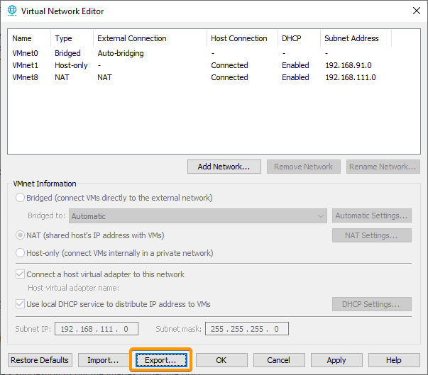
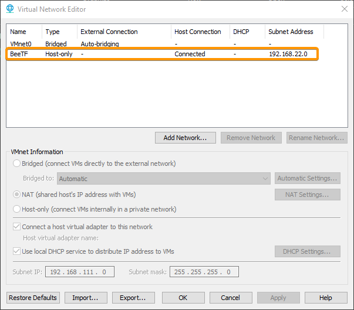

# BeeTF

A bee-themed Capture The Flag challenge for my university's cyber security society! Use every tool at your disposal to uncover the sinister secrets of the Honeypot!

# Setup Instructions

These setup instructions primarily support VMWare for now, due to its heavy usage on campus. It should be possible to achieve a similar result with VirtualBox or QEMU or what have you. Pull requests for setup instructions/config files for these platforms are always welcome.

## Network

On VMWare, please open the Virtual Network Editor. Make sure to `export` any existing configuration; **otherwise you will lose those configured networks!**

Then, import the `BeeTF.vmnet` file provided at the root of this repo. After a moment, you should now have your virtual networks set up like so:

You can always later import your old network configuration, or restore the default configuration in this same dialog box.

### Non-VMWare

The network is setup like so:

* Host-Only (or your equivalent)
* Subnet 192.168.22.0 (mask 255.255.255.0)
* DHCP disabled